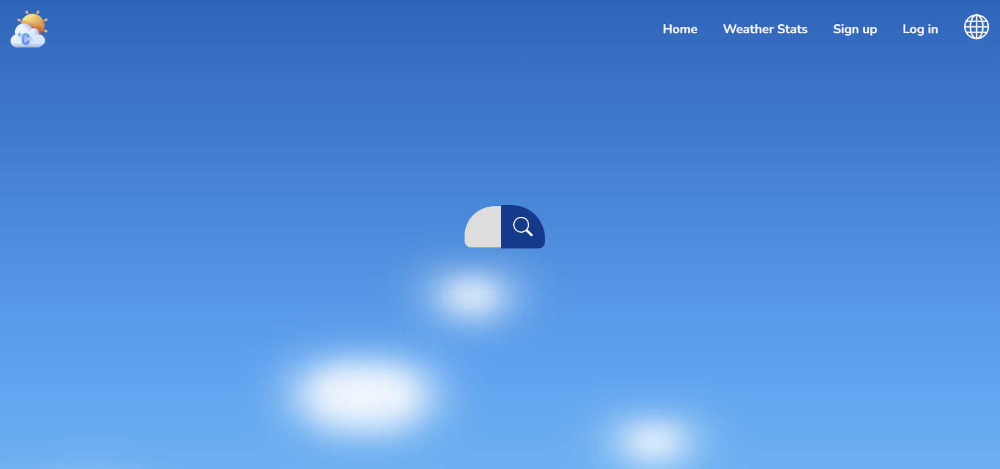
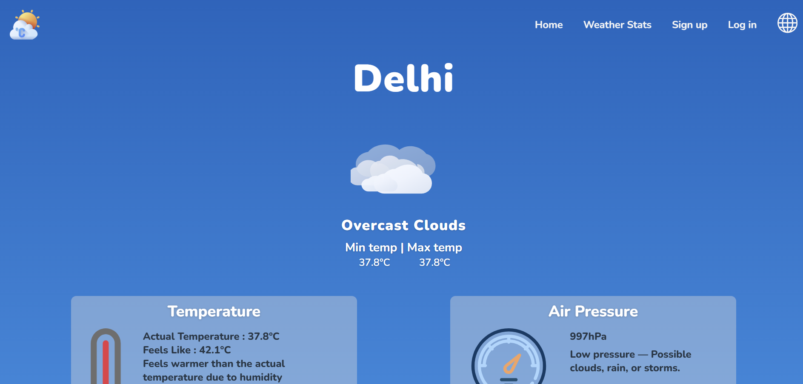
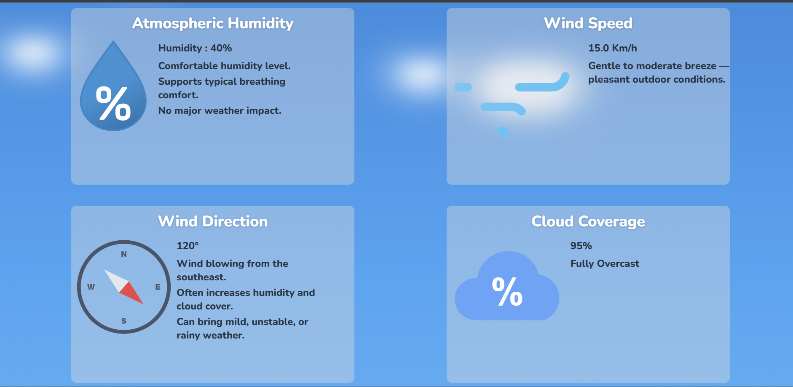

# 🌦️ Weather App

A responsive weather application built with Node.js, Express, and EJS that fetches real-time weather data from the OpenWeatherMap API. Users can search for cities, view current weather conditions, and explore detailed weather statistics through a clean and intuitive interface.

---

## 📸 Preview

<p align="center">
  
  <br>
  
</p>

<p align="center">
  
  <br>
  
</p>

## 🌐 Live Demo

**Live Website:** https://weather-app-y9xo.onrender.com/

---

## ✨ Features

- 🔍 Search weather by city
- 🌡️ View current weather conditions
- 📊 Detailed weather statistics
- 🌤️ Dynamic weather icons
- 📱 Fully responsive design
- ⚡ Fast and user-friendly interface

> **Note:** Authentication pages (Sign Up and Log In) are currently UI prototypes and are not connected to a backend authentication system.

---

## 🛠️ Tech Stack

### Frontend
- HTML5
- CSS3
- JavaScript
- EJS

### Backend
- Node.js
- Express.js

### API
- OpenWeatherMap API

---

## 📂 Project Structure

```
Weather App
├── public/
│   ├── assets/
│   ├── icons/
│   ├── images/
│   ├── js/
│   └── styles/
├── views/
├── index.js
├── package.json
├── .gitignore
└── README.md
```

---

##  Getting Started

### Clone the repository

```bash
git clone https://github.com/gurjot-dev-co/weather-app.git
```

### Install dependencies

```bash
npm install
```

### Create a `.env` file

Create a file named `.env` in the project root and add your OpenWeatherMap API key:

Add your OpenWeatherMap API key:

```env
API_KEY=your_api_key_here
```

### Start the server

```bash
node index.js
```

Open your browser and visit:

```
http://localhost:3000
```

---

## 🔮 Future Improvements

- 🌍 Search suggestions
- 📅 5-day weather forecast
- 🌙 Dark mode
- 🌡️ Celsius/Fahrenheit toggle

---

## 👩‍💻 Author

**Gurjot Kaur**

GitHub: **[@gurjot-dev-co](https://github.com/gurjot-dev-co)**

---

## 📄 License

This project is intended for learning and portfolio purposes.